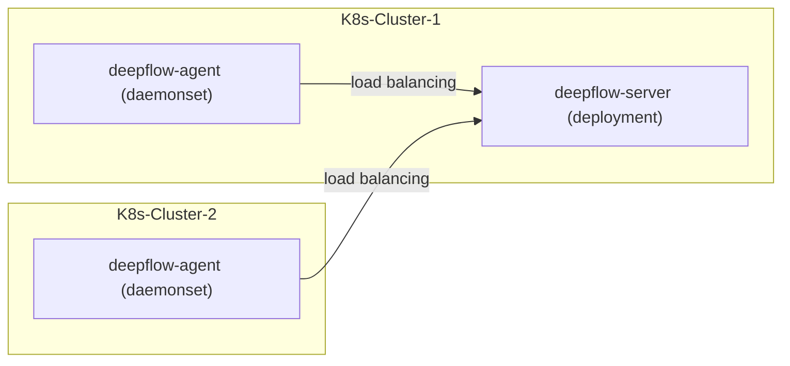

# 简介

假如你要使用 DeepFlow 监控一个新的 K8s 集群。
DeepFlow 能够零侵扰采集所有 Pod 的观测信号（AutoMetrics、AutoTracing、AutoProfiling），
并基于调用 apiserver 获取的信息自动为所有观测数据注入`K8s 资源`和`K8s 自定义 Label`标签（AutoTagging）。

# 准备工作

## 部署拓扑



## 获取 DeepFlow 平台中的 K8s ClusterID

DeepFlow 平台使用公有云的集群 ID 或者随机为每个集群生成一个唯一 ID，从“资源-资源池-云平台”中查看需要部署的集群 ID，形如"cl-xxxxxxxxxx"。

## 获取 DeepFlow Agent 镜像

向云杉网络的同学获取 DeepFlow Agent 镜像地址和镜像 tag。

# 部署 deepflow-agent

使用 Helm 安装 deepflow-agent：

```bash
cat << EOF > values-custom.yaml
deepflowServerNodeIPS:
- 10.1.2.3  # FIXME: DeepFlow Server Node IPs
- 10.4.5.6  # FIXME:  DeepFlow Server Node IPs
deepflowK8sClusterID: "fffffff"  # FIXME: K8s ClusterID
image:
  repository: __FIXME_IMAGE_REPO__
  pullPolicy: Always
  # Overrides the image tag whose default is the chart appVersion.
  tag: __FIXME_IMAGE_TAG__
EOF

helm repo add deepflow https://deepflowio.github.io/deepflow
helm repo update deepflow # use `helm repo update` when helm < 3.7.0
helm install deepflow-agent -n deepflow deepflow/deepflow-agent --create-namespace \
    -f values-custom.yaml
```