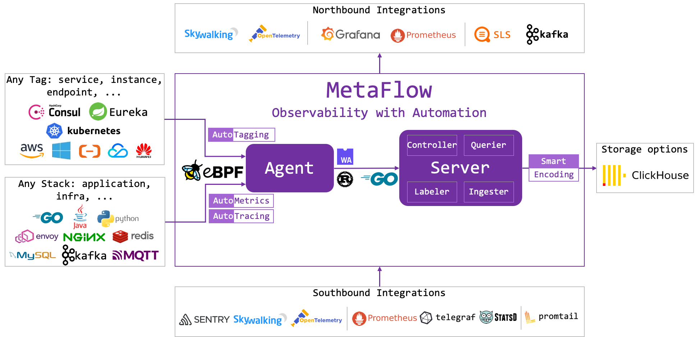

# 软件架构

MetaFlow由Agent和Server两个进程组成。每个K8s容器节点、虚拟机或物理裸机中运行一个Agent，负责该服务器上所有应用进程的AutoMetrics和AutoTracing数据采集。Server运行在一个K8s集群中，提供Agent管理、数据标签注入、数据写入、数据查询服务。

# 设计理念

MetaFlow名称来自对**Flow**的**自动化**采集能力。网络中的Flow对应一个TCP/IP五元组，应用中的Flow对应一个应用Request。MetaFlow使用eBPF等技术自动获取任意软件技术栈的Request-scoped数据，包括Raw data形态的Request-scoped events、聚合后形成的Rquest-scoped metrics、关联后构建的Trace。这些数据通常用于绘制原始请求表、服务调用拓扑、分布式调用火焰图。

除了能够自动化的获取Request-scoped观测数据之外，MetaFlow通过Agent的开放能力集成大量其他开源SDK和Agent数据源，完整覆盖可观测性的Tracing、Metrics、Logging三大支柱。MetaFlow并不是简单的将这些数据纳入进来，独有的AutoTagging和SmartEncoding技术能够高性能、自动化的为所有观测数据注入统一的属性标签，消除数据孤岛，并释放数据的下钻切分能力。

# MetaFlow Agent

MetaFlow Agent使用Rust语言实现，有着极致的处理性能和内存安全性。

Agent采集的数据包括三类：
- **eBPF数据**
  - 基于eBPF（Linux Kernel 4.14+）的**AutoMetrics**机制采集任意应用Request的RED性能指标
  - 基于BPF、AF\_PACKET（Linux Kernel 2.6+）、winpcap（Windows 2008+）的**AutoMetrics**机制采集任意应用Request的RED性能指标、网络吞吐、时延、性能、异常性能指标
  - 基于eBPF（Linux Kernel 4.14+）的**AutoTracing**机制，分析Raw Request数据关联性，构建分布式调用链
- 集成的观测数据：接收其他开源Agent、SDK的观测数据
- 标签数据：自动同步K8s apiserver和服务注册中心中的服务、实例和API属性信息

Agent支持运行于各种工作负载环境中：
- 以Daemonset Pod形态运行于K8s Node中，采集Node中所有Pod的数据
- 以进程形态运行于Linux服务器中，采集服务器中所有进程的数据
- 以进程形态运行于Windows服务器中，采集服务器中所有进程的数据 ^[1]
- 以Sidecar形态运行于Serverless Pod中，采集Pod中所有Container的数据 ^[1]

此外，Agent支持基于WASM向开发者提供可编程接口 ^[1]，用于解析Agent尚未识别的应用协议，以及构建面向具体场景的业务分析能力。

^[1]：计划中的路标功能。

# MetaFlow Server

MetaFlow Server使用Golang实现，由Controller、Labeler、Ingester、Querier四个模块组成：
- Controller：管理Agent、均衡调度Agent与Server的通信关系、同步采集器发现的Tag数据。
- Labeler：向观测数据中注入统一的属性标签。
- Ingester：观测数据存储，插件化机制支持替换分析数据库。
- Querier：观测数据查询，提供统一的SQL接口查询所有类型的观测数据。

MetaFlow的关键特性有两点：
- **AutoTagging**：自动为所有观测数据注入统一的属性标签，消除数据孤岛问题，并释放数据的下钻切分能力
- **SmartEncoding**：利用分布式的编码技术，将属性标签编码为整形值，在标签注入阶段直接注入整形标签，在生产环境中的实际运行数据表明SmartEncoding可将标签存储性能提升一个数量级。

MetaFlow Server以Pod形态运行在K8s集群中，支持水平扩展。Server集群能够自动根据Agent的数据均衡调度Agent与Server之间的通信关系。一个Server集群可管理多个异构资源池中的Agent，并支持跨Region统一管理。

MetaFlow使用的分析数据库是可替换的，目前我们提供ClickHouse作为默认选项，未来会增加对更多数据库的支持，另外也计划支持将不同数据存储到不同的数据库中，充分发挥不同数据库的优势。

MetaFlow提供统一的SQL查询接口，默认提供基于Grafana的数据能力。开发者可以选择通过Grafana可视化数据，也可选择将MetaFlow集成到自己的可观测性平台中。另外我们也计划在SQL之上开发主流的QL方言，例如PromQL等，使得使用者能将数据无缝迁移到MetaFlow。
