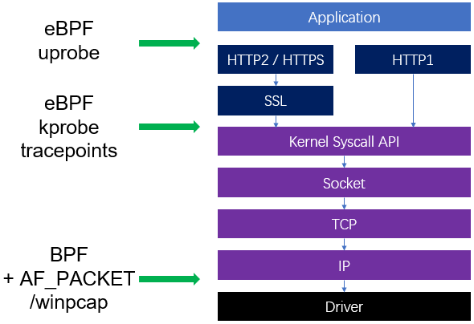
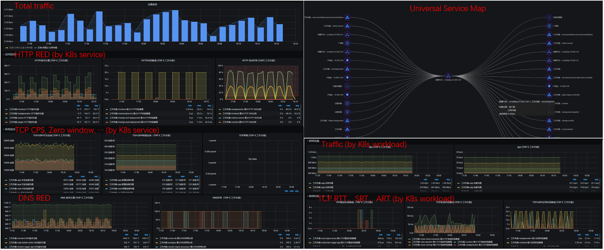
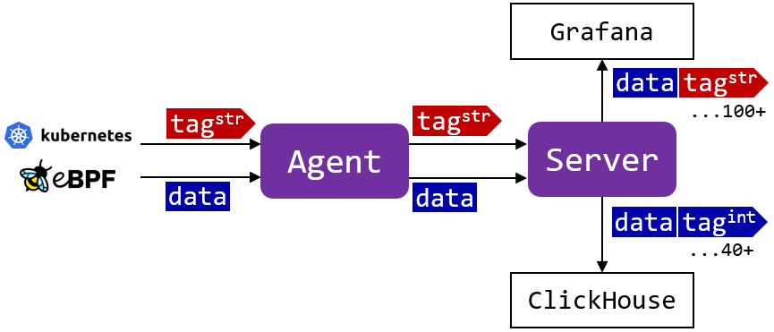

# 全栈

传统的性能指标获取方法必须通过 SDK 、字节码增强或手动埋点方式主动插入统计代码，这给应用开发者带来了沉重的负担，他们需要适配各种开发语言和框架。在云原生环境下手动插码的方式迎来了更多的挑战，任何一个应用调用需要穿越从微服务、Sidecar、iptables/ipvs 容器网络、虚拟机 vsiwtch、云网络、NFV网关等复杂的路径，可观测性建设应该能覆盖云原生环境下从应用到基础设施的全栈。

MetaFlow 基于 eBPF 的 **AutoMetrics** 能力可自动获取系统调用、应用函数、网络通信的性能数据，并通过 BPF 和 AF\_PACKET/winpcap 将这些能力扩展到更广泛的 Linux 内核版本及 Windows 操作系统。

从数据采集的方式可以看到，MetaFlow 可以自动化的采集任意软件技术栈的性能指标：
- Any Dev Stack
  - 任何框架
  - 任何开发语言
- Any Infra Stack
  - Linux、Windows、Android 等操作系统
  - Envoy、Nginx、HAProxy 等七层网关
  - NLB、NATGW 等四层网关
  - MySQL、Redis 等数据库
  - Kafka 等消息队列

目前，MetaFlow 已经通过 eBPF 支持了主流应用协议的解析，包括 HTTP 1/2/S、Dubbo、MySQL、Redis、Kafka、MQTT、DNS，未来还将扩展更多应用协议的支持。基于 MetaFlow 的 AutoMetrics 能力，能够零侵扰的获取应用的 RED（Request、Error、Delay）指标、网络协议栈的吞吐、时延、建连异常、重传、零窗等指标。MetaFlow Agent 会维护每个 TCP 连接、每个应用协议 Request 的会话状态，称之为 `Flow`。所有原始性能指标数据精细至 Flow 粒度，并额外自动聚合为 1s、1min 指标数据。继续这些指标数据，我们可呈现任意服务、工作负载、API 的性能数据，并可绘制任意服务之间的调用关系拓扑图 —— `Universal Service Map`。

在此基础上，MetaFlow 的 **AutoTagging** 能力还能为从不同软件栈上获取到的 Request-scoped 指标数据注入统一的属性标签，包括：
- 资源相关：区域、可用区、宿主机、云服务器、VPC、子网、NATGW、ALB
- 服务相关：集群、节点、命名空间、服务、Ingress、Deployment/StatefulSet、Pod、Label

不同 Agent 采集到的数据会注入统一的标签，这使得我们能从全栈视角全方位观测一个 Request 的性能变化，迅速找到问题所在。

此外，MetaFlow 完全拥抱开源社区，支持接收开源 Agent 或 SDK 的观测数据。通过集成 Prometheus、Telegraf 社区已积淀下来的对各种 Dev/Infra Stack 的指标数据获取能力，MetaFlow 的全栈优势将会得到更大的发挥。将观测数据发送至 MetaFlow 的优势在于同一的 AutoTagging 机制能彻底打破数据孤岛，并能增强数据的下钻切分能力。

# 全链路

随着应用的微服务化，分布式链路追踪逐渐成为一项必备的可观测性能力。但开发者需要花费大量时间用于考虑如何在自己的语言和框架中插码，如何传递上下文等工作。

MetaFlow 并不只是简单的使用 eBPF，通过一系列技术创新，我们将 eBPF Event、BPF Packet、Thread ID、Request 到达时序、TCP 发送时序进行关系，实现了高度自动化的、分布式调用链 **AutoTracing** 能力。目前 AutoTracing 支持同步并发模型、[kernel-level threading](https://en.wikipedia.org/wiki/Thread_(computing)) 模型场景下任意微服务的上下游调用追踪，并在探索异步并发模型、hybrid threading 模型下的自动追踪能力。

通过与 OpenTelemetry 等 Span 数据源的结合，这样的 AutoTracing 能力将更加完善，能够消除分布式调用链中的任何盲点。在下图中的火焰图中我们可以看到：
- 任意微服务的上下游调用都能追踪，包括开发者容易忽略的 DNS、Log 等调用，包括 MySQL 等无法插码的服务
- 任意两个微服务之间的网络路径都能追踪，从应用代码到系统调用、Sidecar、容器网络、虚拟机网络、云网络

除此之外，我们也在探索更多的追踪可能性，例如仅使用 OpenTelmetry 的 API，通过 eBPF 实现 Tracer，从而给编译型语言零侵扰的 Trace 插码能力。随着代码的开源，我们将会逐步解密 AutoTracing 的实现原理。

# 高性能

MetaFlow 对性能有着极致的追求。

自 2016 年开始，MetaFlow 的商业产品开始用 Golang 实现 Agent，并持续迭代至今。从 2021 年开始，我们决定将 Agent 使用 Rust 重构，这一决定使得我们在处理海量 eBPF/BPF 数据时能够消耗更低的资源，通常相当于应用自身的 1%~5%。Rust 有着极致的内存安全性和逼近 C 的性能，特别是在内存消耗、GC 等方面相比 Golang 有显著的优势。

MetaFlow Server 使用 Golang 实现，得益于我们在 Golang 版本 Agent 的深厚积累，我们重写的高性能 map、高性能 pool 均达到了十倍性能的提升，能够显著降低 Server 的资源消耗。一个每秒写入 1M Flow 的生产环境中 Server 消耗的资源一般为业务的 1%。

与观测数据直接相关的性能优化体现在 SmartEncoding 机制上。Agent 通过信息同步获取到字符串格式的标签，汇总到 Server 上。Server 通过对所有的标签进行编码，为所有的数据统一注入 Int 类型的标签并存储到数据库中，与此同时 Grafana 可以直接以字符串格式的标签进行过滤和分组查询。这一编码机制可将标签写入的性能提升 10 倍，极大的降低了数据存储的资源开销。除此之外，Server 还会将 K8s 标签以元数据的方式与观测数据分离存储，无需在每一行观测数据中都存储所有的标签，进一步将资源消耗降低一半。最后，这样的编码机制也能减少数据查询时的磁盘扫描量，提升搜索性能。
