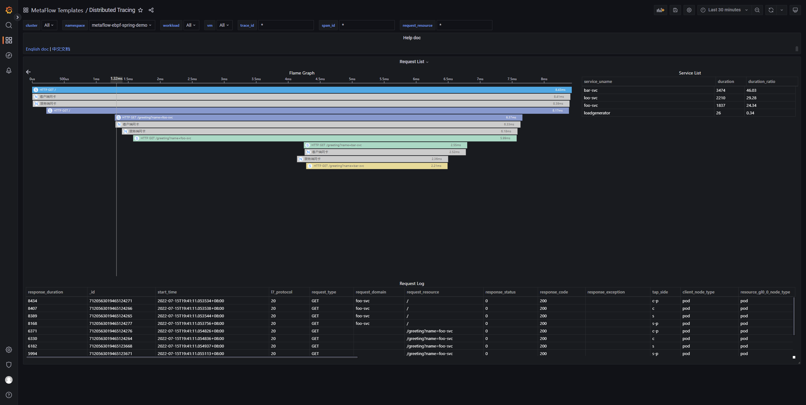

# 简介

本章以一个使用 Spring Boot 开发的微服务应用为例，展示 DeepFlow 的 AutoTracing 能力。

# 部署 Spring Boot Demo

我们使用的 Demo 源自[这个 GitHub 仓库](https://github.com/chanjarster/spring-boot-istio-jaeger-demo)，
它的调用链比较简单：`foo_svc -> bar_svc -> loo_svc -> redis`。

使用如下命令可在 K8s 中快速部署 Demo：
```bash
kubectl apply -f https://raw.githubusercontent.com/deepflowys/deepflow-demo/main/DeepFlow-EBPF-Sping-Demo/deepflow-ebpf-spring-demo.yaml
```

这个 Demo 原始的 GitHub 代码仓库中使用 Jaeger 进行了主动追踪，为了演示 AutoTracing 能力我们特意在上述部署脚本中去掉了 Jaeger。

# 查看分布式追踪

前往 Grafana，打开 `Distributed Tracing` Dashboard，选择 `namespace = deepflow-ebpf-spring-demo` 后，可选择一个调用进行追踪，效果如下图：



DeepFlow 的追踪数据中含有三种 Span，跟踪一次请求的整个轨迹：
- N：通过 BPF 从网络流量中提取的 Span
- S：通过 eBPF 从系统或应用函数调用中提取的 Span
- A：通过 OTel 从应用内部采集的 Span

上图中展示了前两种，第三种在[集成 OpenTelemetry](../agent-integration/tracing/opentelemetry/) 可以展示出来。

[访问 DeepFlow Online Demo](https://ce-demo.deepflow.yunshan.net/d/a3x57qenk/distributed-tracing?orgId=1&var-cluster=All&var-namespace=9&var-workload=All&var-vm=All&var-trace_id=*&var-span_id=*&var-request_resource=*&from=deepflow-doc) 也可查看追踪效果。
