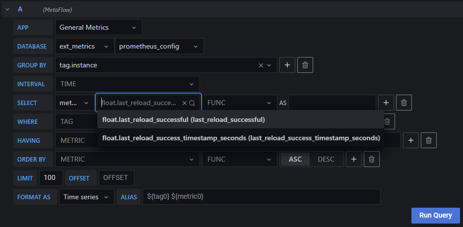

# 数据流

```mermaid
flowchart TD

subgraph K8s-Cluster
  Prometheus["prometheus-server (deployment)"]
  MetaFlowAgent["metaflow-agent (daemonset)"]
  MetaFlowServer["metaflow-server (statefulset)"]

  Prometheus -->|metrics| MetaFlowAgent
  MetaFlowAgent -->|metrics| MetaFlowServer
end
```

# 配置 Prometheus

## 安装 Prometheus

在 [Prometheus 文档](https://prometheus.io/docs/introduction/overview/)中可了解相关背景知识。
如果你的集群中没有 Prometheus，可用如下步骤在 `metaflow-prometheus-demo` 命名空间中快速部署一个 Prometheus：
```bash
# add helm chart
helm repo add prometheus-community https://prometheus-community.github.io/helm-charts
helm repo update

# install prometheus
helm install prometheus prometheus-community/prometheus -n metaflow-prometheus-demo --create-namespace
```

## 配置 remote_write

我们需要配置 Prometheus `remote_write`，将数据发送给 MetaFlow Agent。

首先确定 MetaFlow Agent 启动的数据监听服务的地址。在[安装 MetaFlow Agent](../../install/single-k8s/) 后，会显示 MetaFlow Agent Service 地址，它的默认值是 `metaflow-agent.default`，请根据实际的服务名称与命名空间填写到配置中。

执行以下命令可修改 Prometheus 的默认配置（假设它在 `metaflow-prometheus-demo` 中）：
```bash
kubectl edit cm -n metaflow-prometheus-demo prometheus-server
```

配置 `remote_write` 地址（请修改 `METAFLOW_AGENT_SVC`）：
```yaml
remote_write:
  - url: http://${METAFLOW_AGENT_SVC}/api/v1/prometheus
```

# 配置 MetaFlow

请参考[配置 MetaFlow](../tracing/opentelemetry/#配置-metaflow) 一节内容，完成 MetaFlow Agent 配置。

# 查看 Prometheus 数据

Prometheus 中的指标将会存储在 MetaFlow 的 `ext_metrics` database 中。为了降低 table 的数量，
MetaFlow 会将指标名称按 `_` 分隔后取前 N 节（默认取前 1 节），将拥有相同前缀的指标合并在一个 table 中。

MetaFlow 会将 Prometheus 的原始标签保存在 tag.X 中，原始指标保存在 int.X 或 float.X 中。
使用 Grafana，选择 `MetaFlow` 数据源进行搜索时的展现图下图：



除此之外 MetaFlow 还会向每个数据中依靠 [AutoTagging](./metrics-auto-tagging/) 自动注入大量标签，
使得 Prometheus 采集的数据可以与其他数据源无缝关联。
