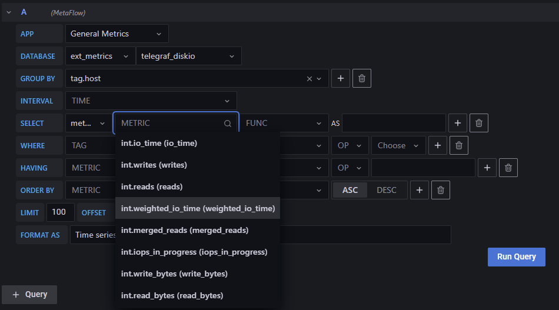

# 数据流

```mermaid
flowchart TD

subgraph K8s-Cluster
  Telegraf1["telegraf (daemonset)"]
  MetaFlowAgent1["metaflow-agent (daemonset)"]
  MetaFlowServer["metaflow-server (statefulset)"]

  Telegraf1 -->|metrics| MetaFlowAgent1
  MetaFlowAgent1 -->|metrics| MetaFlowServer
end

subgraph Host
  Telegraf2[telegraf]
  MetaFlowAgent2[metaflow-agent]

  Telegraf2 -->|metrics| MetaFlowAgent2
  MetaFlowAgent2 -->|metrics| MetaFlowServer
end
```

# 配置 Telegraf

## 安装 Telegraf

在 [Telegraf 文档](https://www.influxdata.com/time-series-platform/telegraf/)中可了解相关背景知识。
如果你的集群中没有 Telegraf，可用如下步骤快速以 DaemonSet 方式部署 Telegraf：
```bash
# add helm chart
helm repo add influxdata https://helm.influxdata.com/

# install telegraf
helm upgrade --install telegraf influxdata/telegraf -n metaflow-telegraf-demo --create-namespace

# switch from deployment to daemonset
kubectl apply -f https://raw.githubusercontent.com/metaflowys/metaflow-demo/main/metaflow-telegraf-demo/metaflow-telegraf-demo.yaml
```

## 配置 Telegraf 数据输出

我们需要修改 Telegraf 的配置，使 Telegraf 将数据发送给 MetaFlow Agent。

首先，我们需要确定 MetaFlow Agent 启动的数据监听服务的地址。在[安装 MetaFlow Agent](../../install/single-k8s/) 后，
会显示 MetaFlow Agent Service 地址，它的默认值是 `metaflow-agent.default`。
如果你修改了它，请根据实际的服务名称与命名空间填写到配置中。

接下来修改 Telegraf 的默认配置（假设它位于 `metaflow-telegraf-demo` 命名空间中）：
```bash
kubectl edit cm -n metaflow-telegraf-demo telegraf
```

在 `telegraf.conf` 中，增加如下配置：
```toml
[[outputs.http]]
  url = "http://${METAFLOW_AGENT_SVC}/api/v1/telegraf"
  data_format = "influx"
```

# 配置 MetaFlow

请参考 [配置 MetaFlow](../tracing/opentelemetry/#配置-metaflow) 一节内容，完成 MetaFlow Agent 配置。

# 查看 Telegraf 数据

Telegraf 中的指标将会存储在 MetaFlow 的 `ext_metrics` database 中。

MetaFlow 会将 Telegraf 的原始标签保存在 tag.X 中，原始指标保存在 int.X 或 float.X 中。
使用 Grafana，选择 `MetaFlow` 数据源进行搜索时的展现图下图：


除此之外 MetaFlow 还会向每个数据中依靠 [AutoTagging](./metrics-auto-tagging/) 自动注入大量标签，
使得 Telegraf 采集的数据可以与其他数据源无缝关联。
